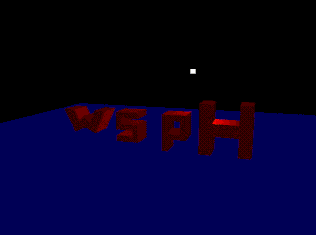
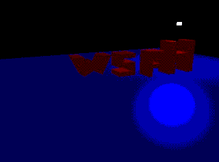

# Assignment 1: OpenGL intro and basic shading


## * To compile and run

```
make
./main.out
```

## * OSX users

There is a weird bug I run into when fixing the support for OSX, it seems the **first time you compile the code in modern support** the glfw clock doesn't work, so you may see the scene as static, and the light sources won't move. Just closing the application and running it again made the trick in my case.

## * Some sample output

### Legacy OpenGL



### Modern OpenGL



## * About the code structure

This is a first attempt to make the base objects for a 3d game engine, hopefully some code will be reusable as I intended.

1. The **engine** folder is where most of the code will be ported, for now just has the basic application class which creates the window and application according to the window system requested. Also, initializes GLEW for modern OpenGL usage.

2. The **miniengine** folder ( located in assignments/assignment1/miniengine )  is where the code for the assignment was implemented in an engine-like fashion.

3. The **assignment1** folder contains the assignment implementation in the main.cpp file. This makes use of the _engine_ and _miniengine_ libraries.


## * About the code implementation

For the assignment, just some files should be looked at :

1. **main.cpp** : In this file we extend our application class to create the window with GLUT support ( there is also GLFW support in LINUX ), and create some objects using the miniengine code. We create the letters and a plane using a Mesh Builder ( implemented LMeshBuilder file ). The scene by default contains a light source, which can be switched to directional or punctual using a key during execution ( L key )

2. **LScene.cpp** : This file represents the scene and stores the light source objects and the mesh objects. Our letters and the plane are mesh objects, and the lamp is a light source object. This meshes are _LMesh_ objects, which are constructed using the Mesh builder class.

3. **LMesh.cpp** : This file represents a mesh in 3d space and contains all the necessary data to render the object using OpenGL. Just check the **render** method, which is dependent of using modern or legacy accordingly.

4. **LMeshBuilder.cpp** : This is the file that contains the implementation of the meshbuilder we use to create the object we use in our scene. Currently, it supports cubes, planes and extrusions.
The extrusion objects are the ones we use to build our letters, and these are built using a 2d profile given by a polygon ( convex or concave ) which is tesselated using the ear-clipping triangulation algorithm to generate the triangles. The implementation of the ear clipping algorithm is located in the LMiniCommon.h file, inside the implementation of the LPolygon class ( see **earClipTriangulate** in the **LPolygon** class )

5. **shaders** : The shaders are located in the **res** folder, and there are two pairs of shaders. One pair is used to render object with no lighting, which is used to render the lamp that represents the lightsource, and the other pair is used to render objects with lighting. The pair used for the lighting case are shown below.

**baseVertexShader3d_with_lighting.glsl**

```glsl
#version 330 core

layout ( location = 0 ) in vec3 position;
layout ( location = 1 ) in vec3 normal;

uniform mat4 u_tModel;
uniform mat4 u_tView;
uniform mat4 u_tProj;

out vec3 vNormal;
out vec3 vFragPos;

void main()
{
    gl_Position = u_tProj * u_tView * u_tModel * vec4( position, 1.0f );
    vFragPos = vec3( u_tModel * vec4( position, 1.0f ) );
    vNormal = mat3( transpose( inverse( u_tModel ) ) ) * normal;
}
```

**baseFragmentShader3d_with_lighting.glsl**

```glsl
#version 330 core

uniform vec3 u_light_ambient;
uniform vec3 u_light_diffuse;
uniform vec3 u_light_specular;
uniform vec3 u_light_position;
uniform int u_light_type;
uniform vec3 u_light_dir;

uniform vec3 u_mat_ambient;
uniform vec3 u_mat_diffuse;
uniform vec3 u_mat_specular;
uniform float u_mat_shininess;

uniform vec3 u_view_pos;

in vec3 vNormal;
in vec3 vFragPos;
out vec4 color;

void main()
{
    // ambient component

    vec3 c_ambient = u_light_ambient * u_mat_ambient;

    // diffuse component

    // check if positional or directional

    vec3 _normal = normalize( vNormal );
    vec3 _lightDir = vec3( 0.0f, 0.0f, 0.0f );

    if ( u_light_type == 1 )
    {
        _lightDir = normalize( u_light_position - vFragPos );
    }
    else
    {
        _lightDir = normalize( -u_light_dir );
    }
    
    float _diff = max( dot( _normal, _lightDir ), 0.0 );
    vec3 c_diffuse = _diff * u_light_diffuse * u_mat_diffuse;

    vec3 _viewDir = normalize( u_view_pos - vFragPos );
    vec3 _reflectDir = reflect( -_lightDir, _normal );
    float _spec = pow( max( dot( _viewDir, _reflectDir ), 0.0 ), u_mat_shininess );
    vec3 c_specular = _spec * u_light_specular * u_mat_specular;

    vec3 _res = ( c_ambient + c_diffuse + c_specular );

    color = vec4( _res, 1.0 );
}
```


## Some other stuff


The file **editor_ear_clipping_test.cpp** contains a simple editor to test the tesselation of a 2d polygon using the ear-clipping algorithm. To use it, just compile everything with legacy opengl enabled.