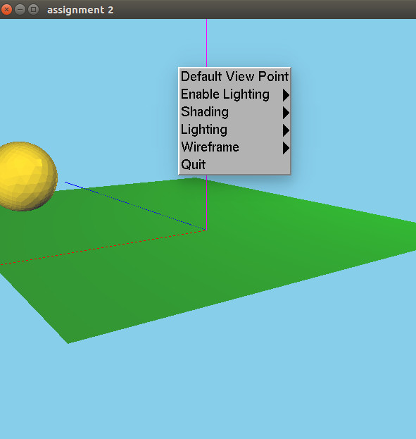
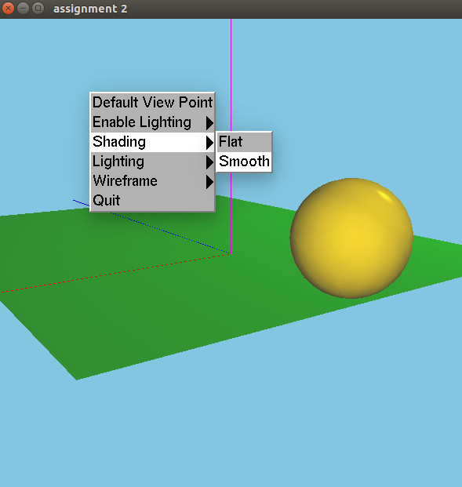
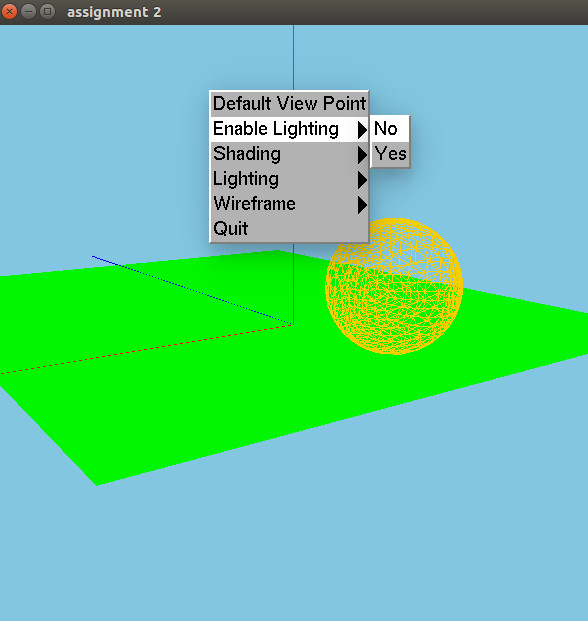
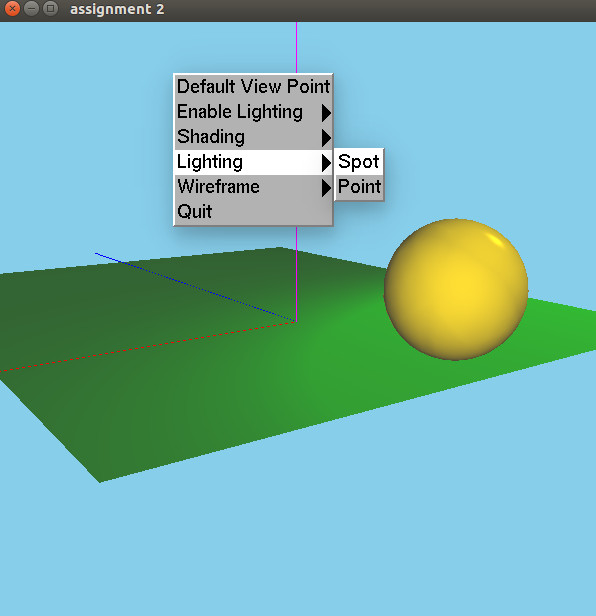

# Assignment 2: Playing with transformations and shading


## * To compile and run

Check the root [README](https://github.com/wpumacay/wilbert-pumacay-graficos-2017-2/blob/master/README.md), and then just run the executable

```
cd [repo-root]
cmake .
make
cd [repo-root]/assignments/assignment2/
./assignment2.out
```

## * OSX users

To use in macOS please make sure you are using GLUT and v120 enabled in the root CMakeLists.txt file. More info can be found in the root README.md .

## * Some sample output

### Default scene with flat shading, a punctual light source and a directional light source



### Scene with smooth shading



### Scene in wireframe mode and lighting disabled



### Scene with a spotlight instead of a pointlight



## * About the code structure

This is a second attempt to make the base objects for a 3d game engine. There is some more structure than the previous assignment, but still is work in progress. 

All engine files are in **this** folder, and the specifics are in the **hw** folder.

## * About the code implementation

For the assignment, just some files should be looked at :

1. [**main.cpp**]( https://github.com/wpumacay/wilbert-pumacay-graficos-2017-2/blob/master/assignments/assignment2/main.cpp ) : In this file we create the test scene, the renderer and some additional stuff. Our render loop resides here.

2. [**LTestScene.h**]( https://github.com/wpumacay/wilbert-pumacay-graficos-2017-2/blob/master/assignments/assignment2/hw/LTestScene.h ) : This file extends the basic scene and creates the necessary objects required by the assignment. You can see there the lights initialization, camera initialization and some entities creations, specially the sphere.

3. [**LBallEntity.h**]( https://github.com/wpumacay/wilbert-pumacay-graficos-2017-2/blob/master/assignments/assignment2/hw/LBallEntity.h ) : This file extends the base entity and creates the sphere mesh to be used in our application.

4. [**LBallMovementComponent.h**]( https://github.com/wpumacay/wilbert-pumacay-graficos-2017-2/blob/master/assignments/assignment2/hw/LBallMovementComponent.h ) : This file is the implementation of the movement handler that makes the ball roll. Here we compute the rotation and translation required and set it to the entity's, which in turn sets the position and orientation of the mesh component.

5. [**engine**]( https://github.com/wpumacay/wilbert-pumacay-graficos-2017-2/blob/master/assignments/assignment2/ ) : 
There are quite a few files that I created for this project. Basically, I abstracted the vertex buffer creations into classes. Also, like the previous assignment, I created a Mesh class, but this now makes use of the material, vertexbuffer, vertexarray and indexbuffer classes to handle the rendering. The camera was also abstracted away, and a fixed3d camera was made for the assigment. There are three types of lights supported: directional, pointlight and spotlight. Also, there is a renderer that is in charge of setting all the properties given by the lights, camera and projection; and renders each mesh in turn by calling its components.

The shaders used are the following:

[**basic3d_lighting_vs_120.glsl**]( https://github.com/wpumacay/wilbert-pumacay-graficos-2017-2/blob/master/assignments/assignment2/res/shaders/basic3d_lighting_vs_120.glsl )

```glsl
#version 120

attribute vec3 position;
attribute vec3 normal;

uniform mat4 u_tModel;
uniform mat4 u_tView;
uniform mat4 u_tProj;

varying vec3 vNormal;
varying vec3 vFragPos;

void main()
{
    gl_Position = u_tProj * u_tView * u_tModel * vec4( position, 1.0f );
    vFragPos = vec3( u_tModel * vec4( position, 1.0f ) );
    vNormal = mat3( u_tModel ) * normal;
}
```

[**basic3d_lighting_fs_120.glsl**]( https://github.com/wpumacay/wilbert-pumacay-graficos-2017-2/blob/master/assignments/assignment2/res/shaders/basic3d_lighting_fs_120.glsl )

```glsl
#version 120


struct LLightDirectional
{
    vec3 direction;
    // phong model components
    vec3 ambient;
    vec3 diffuse;
    vec3 specular;

    int isActive;
};

struct LLightPoint
{
    vec3 position;
    // attenuation parameters
    float constant;
    float linear;
    float quadratic;
    // phong model components
    vec3 ambient;
    vec3 diffuse;
    vec3 specular;

    int isActive;
};

struct LLightSpot
{
    vec3 position;
    vec3 direction;

    float cutOff;
    float outerCutOff;
    // phong model components
    float constant;
    float linear;
    float quadratic;
    // phong model components
    vec3 ambient;
    vec3 diffuse;
    vec3 specular;

    int isActive;
};

struct LMaterial
{
    vec3 ambient;
    vec3 diffuse;
    vec3 specular;
    float shininess;
};


#define MAX_DIRECTIONAL_LIGHTS 2
#define MAX_POINT_LIGHTS 5
#define MAX_SPOT_LIGHTS 5

uniform LLightDirectional u_directionalLights[MAX_DIRECTIONAL_LIGHTS];
uniform LLightPoint u_pointLights[MAX_POINT_LIGHTS];
uniform LLightSpot u_spotLights[MAX_SPOT_LIGHTS];
uniform int u_numDirectionalLights;// To see how many of these have we created
uniform int u_numPointLights;// To see how many of these have we created
uniform int u_numSpotLights;// To see how many of these have we created
uniform vec3 u_globalAmbientLight;

uniform LMaterial u_material;
uniform vec3 u_viewPos;

varying vec3 vNormal;
varying vec3 vFragPos;

vec3 computeDirectionalContribution( LLightDirectional light, vec3 normal, vec3 viewDir );
vec3 computePointContribution( LLightPoint light, vec3 normal, vec3 fragPos, vec3 viewDir );
vec3 computeSpotContribution( LLightSpot light, vec3 normal, vec3 fragPos, vec3 viewDir );

void main()
{

    vec3 _normal = normalize( vNormal );
    vec3 _viewDir = normalize( u_viewPos - vFragPos );

    vec3 _result = u_material.ambient * u_globalAmbientLight;

    for ( int q = 0; q < u_numDirectionalLights; q++ )
    {
        if ( q > MAX_DIRECTIONAL_LIGHTS - 1 )
        {
            break;
        }
        if ( u_directionalLights[q].isActive == 0 )
        {
            continue;
        }
        _result += computeDirectionalContribution( u_directionalLights[q],
                                                   _normal, _viewDir );
    }

    for ( int q = 0; q < u_numPointLights; q++ )
    {
        if ( q > MAX_POINT_LIGHTS - 1 )
        {
            break;
        }
        if ( u_pointLights[q].isActive == 0 )
        {
            continue;
        }
        _result += computePointContribution( u_pointLights[q],
                                              _normal, vFragPos, _viewDir );
    }

    for ( int q = 0; q < u_numSpotLights; q++ )
    {
        if ( q > MAX_SPOT_LIGHTS - 1 )
        {
            break;
        }
        if ( u_spotLights[q].isActive == 0 )
        {
            continue;
        }
        _result += computeSpotContribution( u_spotLights[q],
                                            _normal, vFragPos, _viewDir );
    }


    gl_FragColor = vec4( _result, 1.0 );
}

vec3 computeDirectionalContribution( LLightDirectional light, vec3 normal, vec3 viewDir )
{
    vec3 _lightDir = normalize( -light.direction );
    // diffuse shadding
    float _diff = max( dot( normal, _lightDir ), 0.0 );
    // specular shading
    vec3 _reflectDir = reflect( -light.direction, normal );
    float _spec = pow( max( dot( viewDir, _reflectDir ), 0.0 ), u_material.shininess );
    // calculate components
    vec3 _ambient  = light.ambient * u_material.ambient;
    vec3 _diffuse  = _diff * light.diffuse * u_material.diffuse;
    vec3 _specular = _spec * light.specular * u_material.specular;
    
    return _ambient + _diffuse + _specular;
}

vec3 computePointContribution( LLightPoint light, vec3 normal, vec3 fragPos, vec3 viewDir )
{
    vec3 _lightDir = normalize( light.position - fragPos );
    // diffuse shadding
    float _diff = max( dot( normal, _lightDir ), 0.0 );
    // specular shading
    vec3 _reflectDir = reflect( -_lightDir, normal );
    float _spec = pow( max( dot( viewDir, _reflectDir ), 0.0 ), u_material.shininess );
    // attenuation
    float _distance = length( light.position - fragPos );
    float _attenuation = 1.0 / ( light.constant + 
                                 light.linear * _distance + 
                                 light.quadratic * _distance * _distance );
    // calculate components
    vec3 _ambient  = light.ambient * u_material.ambient;
    vec3 _diffuse  = _diff * light.diffuse * u_material.diffuse;
    vec3 _specular = _spec * light.specular * u_material.specular;
    _ambient  *= _attenuation;
    _diffuse  *= _attenuation;
    _specular *= _attenuation;
    
    return _ambient + _diffuse + _specular;
}

vec3 computeSpotContribution( LLightSpot light, vec3 normal, vec3 fragPos, vec3 viewDir )
{
    vec3 _lightDir = normalize( light.position - fragPos );
    // diffuse shadding
    float _diff = max( dot( normal, _lightDir ), 0.0 );
    // specular shading
    vec3 _reflectDir = reflect( -_lightDir, normal );
    float _spec = pow( max( dot( viewDir, _reflectDir ), 0.0 ), u_material.shininess );
    // attenuation
    float _distance = length( light.position - fragPos );
    float _attenuation = 1.0 / ( light.constant + 
                                 light.linear * _distance + 
                                 light.quadratic * _distance * _distance );
    // spotlight intensity
    float _ctheta = dot( _lightDir, normalize( -light.direction ) );
    float _epsilon = light.cutOff - light.outerCutOff;
    float _intensity = clamp( ( _ctheta - light.outerCutOff ) / _epsilon, 0.0, 1.0 );
    // calculate components
    vec3 _ambient  = light.ambient * u_material.ambient;
    vec3 _diffuse  = _diff * light.diffuse * u_material.diffuse;
    vec3 _specular = _spec * light.specular * u_material.specular;
    _ambient  *= _attenuation * pow( _intensity, 15 );
    _diffuse  *= _attenuation * pow( _intensity, 15 );
    _specular *= _attenuation * pow( _intensity, 15 );
    
    return _ambient + _diffuse + _specular;
}
```

The engine supports multiple lights, as you can see in the fragment shader. This was based on [**this**](https://learnopengl.com/#!Lighting/Light-casters) tutorial.

There are also some debug shaders that are used for rendering debug primitives, like the axis. These were intended to draw some other stuff, like normals and bounding boxes. As I said, still work in progress :(.


## * About the requirements of the assignment

### a) Read spheres :

This part is implemented in the [**LMeshBuilder**]( https://github.com/wpumacay/wilbert-pumacay-graficos-2017-2/blob/master/assignments/assignment2/LMeshBuilder.cpp ) class ( see the LMeshBuilder::createFromFile method). This method returns a mesh object, which creates the necessary objects to use for rendering.

### b) Setup viewing :

This part is implemented in the [**LTestScene**]( https://github.com/wpumacay/wilbert-pumacay-graficos-2017-2/blob/master/assignments/assignment2/hw/LTestScene.h ) class ( see its constructor, there I create an instance of the LFixedCamera3d class ). The camera class is in charge of generating the view matrix given its data.

### c), d) Roll sphere :

This part is implemented in the [**LBallMovementComponent**]( https://github.com/wpumacay/wilbert-pumacay-graficos-2017-2/blob/master/assignments/assignment2/hw/LBallMovementComponent.h ) class. There, we create a rotation matrix initalized to the entity's rotation matrix, and every update call we change this matrix by a rotation around an arbitrary axis, which is perpendicular to the movement direction. The modelmatrix is created in the LMesh class ( see the getModelMatrix method ). Note that we use accumulate the rotation to avoid the weird behaviour of resetting the orientation of the ball when a new direction is requested.

### e) User interface :

This part is implemented in the [**main.cpp**]( https://github.com/wpumacay/wilbert-pumacay-graficos-2017-2/blob/master/assignments/assignment2/main.cpp ) file. There you can see in the main routine that we create the requested menus.

### f) Enable lighting :

You can check this part in the [**LSceneRenderer**]( https://github.com/wpumacay/wilbert-pumacay-graficos-2017-2/blob/master/assignments/assignment2/LSceneRenderer.cpp ) class. There you can see that there are two methods to enable-disable the lighting. What they do is just switch to a basic3d pair of shaders that just uses plain color in the fragment shader. In the main.cpp file we request the enable-disable functionality of both the renderer and the scene. The scene just sets its meshes to make sure to use the correct shader and bind the correct properties.

### g) Shading :

As you saw previously, the fragment shaders are capable of handling the phong shading model. We send the required data per mesh, like normals and materials, as well as setting the lights properties in the fragment shader. This part is done in the **begin**, **renderScene**, **render** and **end** methods in the renderer.

### h) Light source :

As said previously, we support directional, point and spot lights. Check the appropiate classes according to its names to check the details. Each instance of this classes has the data required in the fragment shader for that particular light.