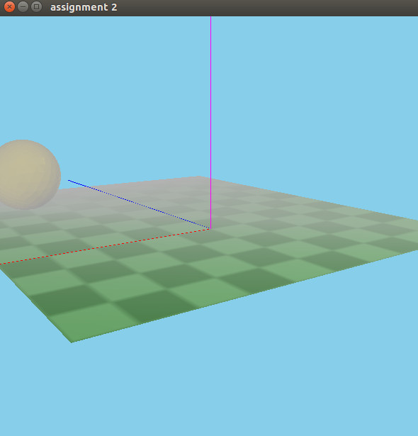

# Assignment 3: Fog and simple texture mapping


## * To compile and run

Check the root [README](https://github.com/wpumacay/wilbert-pumacay-graficos-2017-2/blob/master/README.md), and then just run the executable

```
cd [repo-root]
cmake .
make
cd [repo-root]/assignments/assignment3/
./assignment3.out
```

## * OSX users

To use in macOS please make sure you are using GLUT and v120 enabled in the root CMakeLists.txt file. More info can be found in the root README.md .

## * Some sample output

### Scene with fog and texture enabled



### Scene with fog and texture disabled


## * About the code structure

This is a third attempt to make the base objects for a 3d game engine. There is even more structure ( refactored a lot ) than the previous assignment, but still is work in progress. 

All engine files are in **this** folder, and the specifics are in the **hw** folder.

## * About the code implementation

For this assignment, the following files were added/modified :

1. [**LTestScene.h**]( https://github.com/wpumacay/wilbert-pumacay-graficos-2017-2/blob/master/assignments/assignment3/hw/LTestScene.h ) : I modified the scene so that it includes fog. It creates a fog object, which holds the parameters passed to the appropiate shader. It also is in charge of creating the checkerboard texture and create a texture object using this data.

2. [**LFog.h**]( https://github.com/wpumacay/wilbert-pumacay-graficos-2017-2/blob/master/assignments/assignment3/LFog.h ) : 
I created a fog object that holds the data of the fog configuration.

3. [**LTexture.h**]( https://github.com/wpumacay/wilbert-pumacay-graficos-2017-2/blob/master/assignments/assignment3/LTexture.h ) : 
This class is in charge of holding the texture info and bind it when necessary.

4. [**shaders**](https://github.com/wpumacay/wilbert-pumacay-graficos-2017-2/blob/master/assignments/assignment3/res/shaders/)
I added 2 more shaders : A non-lighting texture based [**shader**](https://github.com/wpumacay/wilbert-pumacay-graficos-2017-2/blob/master/assignments/assignment3/res/shaders/basic3d_textured_fs_120.glsl), to draw when lighting is disabled, and a lighting texture based [**shader**](https://github.com/wpumacay/wilbert-pumacay-graficos-2017-2/blob/master/assignments/assignment3/res/shaders/basic3d_lighting_textured_fs_120.glsl) to draw when lighting is enabled. The shaders that handle lighting were modified to include the fog calculations.

The parts of the code modified for the fog calculation are the following.

[**basic3d_lighting_textured_vs_120.glsl**](https://github.com/wpumacay/wilbert-pumacay-graficos-2017-2/blob/master/assignments/assignment3/res/shaders/basic3d_lighting_textured_vs_120.glsl)
```glsl
    // ...

    if ( u_fog.isActive == 1 )
    {
        if ( u_fog.type == FOG_TYPE_LINEAR )
        {
            vVisibility = 1 - ( _distToCamera - u_fog.start ) / ( u_fog.end - u_fog.start );
        }
        else if ( u_fog.type == FOG_TYPE_EXP )
        {
            vVisibility = exp( -( _distToCamera - u_fog.start ) * u_fog.density );
        }
        else if ( u_fog.type == FOG_TYPE_EXP_SQUARE )
        {
            vVisibility = exp( -pow( ( _distToCamera - u_fog.start ) * u_fog.density, 2 ) );
        }

        vVisibility = clamp( vVisibility, 0.0f, 1.0f );
    }
    else
    {
        vVisibility = 1.0f;
    }

    // ...
```

[**basic3d_lighting_textured_fs_120.glsl**](https://github.com/wpumacay/wilbert-pumacay-graficos-2017-2/blob/master/assignments/assignment3/res/shaders/basic3d_lighting_textured_fs_120.glsl)

```glsl
    // ...

    gl_FragColor.rgb = mix( u_fog.color, gl_FragColor, vVisibility ).rgb;

    // ...
```

## * About the requirements of the assignment

### a) Fog :

This part is implemented in the [**LFog.h**]( https://github.com/wpumacay/wilbert-pumacay-graficos-2017-2/blob/master/assignments/assignment3/LFog.h ) class, and the [**basic3d_lighting_textured_fs_120.glsl**](https://github.com/wpumacay/wilbert-pumacay-graficos-2017-2/blob/master/assignments/assignment3/res/shaders/basic3d_lighting_textured_fs_120.glsl) and [**basic3d_lighting_textured_vs_120.glsl**](https://github.com/wpumacay/wilbert-pumacay-graficos-2017-2/blob/master/assignments/assignment3/res/shaders/basic3d_lighting_textured_vs_120.glsl) shaders.

### b) Texture mapping :

This part is implemented in the [**LTexture.cpp**]( https://github.com/wpumacay/wilbert-pumacay-graficos-2017-2/blob/master/assignments/assignment3/LTexture.cpp ) and the [**basic3d_lighting_textured_fs_120.glsl**](https://github.com/wpumacay/wilbert-pumacay-graficos-2017-2/blob/master/assignments/assignment3/res/shaders/basic3d_lighting_textured_fs_120.glsl) and [**basic3d_lighting_textured_vs_120.glsl**](https://github.com/wpumacay/wilbert-pumacay-graficos-2017-2/blob/master/assignments/assignment3/res/shaders/basic3d_lighting_textured_vs_120.glsl) shaders.
