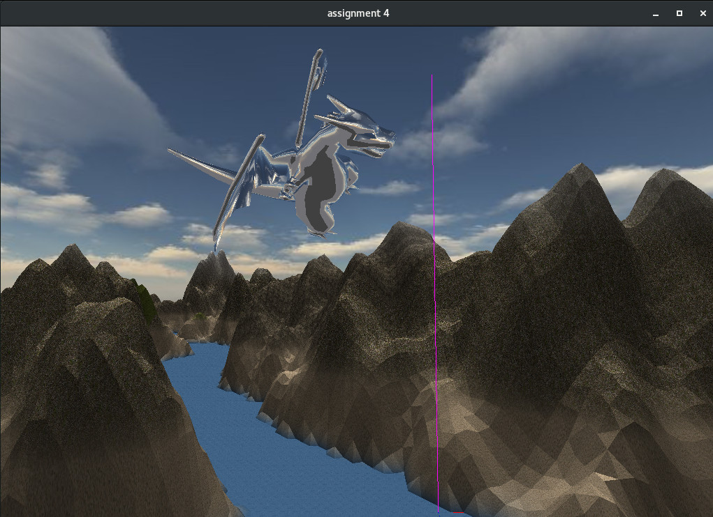

# Assignment 4: Terrain generation, texture mapping and env mapping


## * To compile and run

Check the root [README](https://github.com/wpumacay/wilbert-pumacay-graficos-2017-2/blob/master/README.md), and then just run the executable

```
cd [repo-root]
cmake .
make
cd [repo-root]/assignments/assignment4/
./assignment4.out
```

## * OSX users

To use in macOS please make sure you are using GLUT and v120 enabled in the root CMakeLists.txt file. More info can be found in the root README.md .

## * Some sample output


